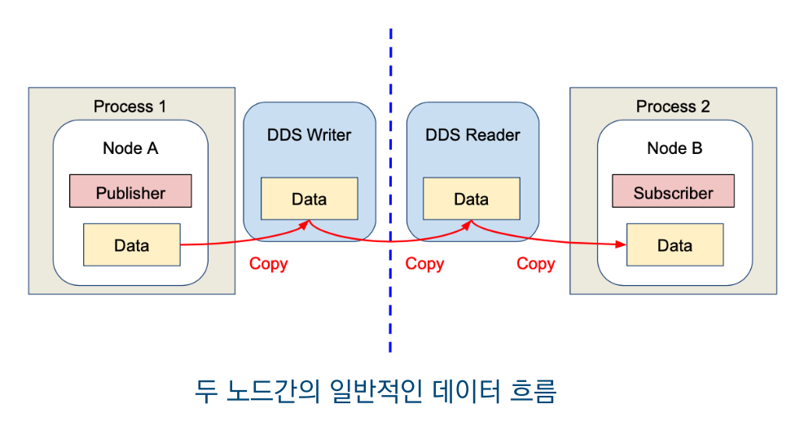
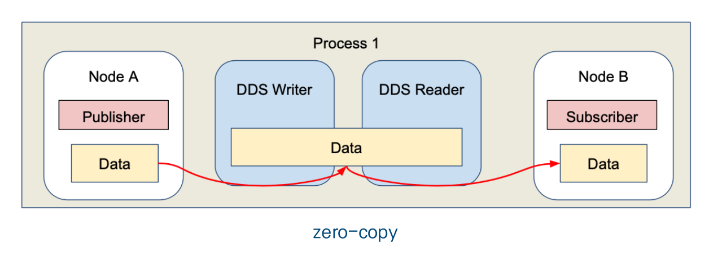
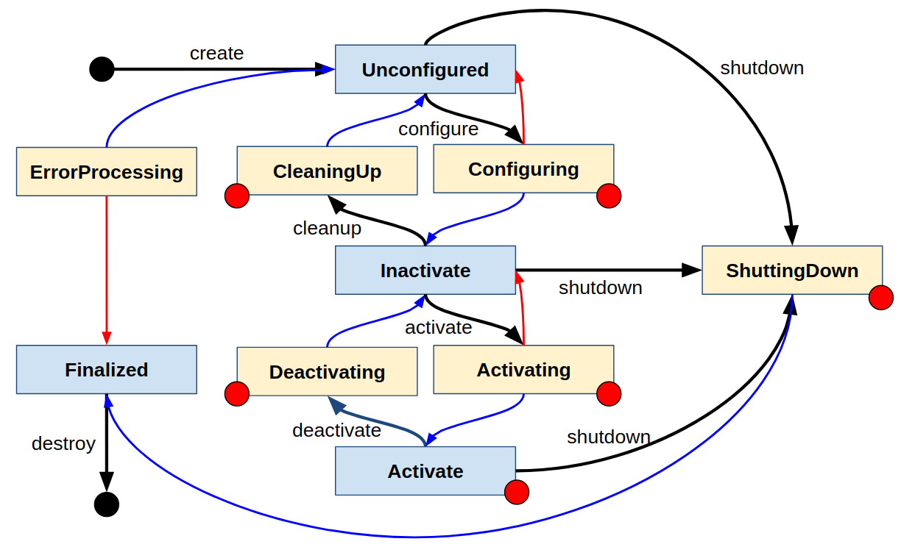

## IPC(Intra-Process Communication)

ROS2는 여러 개의 노드(Node)를 사용하여 시스템을 구성한다.

그리고 일반적으로 노드가 서로 다른 프로세스에서 실행되면 DDS를 거치면서 데이터가 여러 번 복사된다.



이 과정에서 메모리 사용량, CPU 사용량 등이 증가하고, 통신속도 또한 느려질 수 있다.

IPC는 **여러 노드를 하나의 프로세스 안에서 실행** 하여 DDS 복사를 최소화하는 기능이다.



여기서 사용되는 방식이 Zero-Copy이다.

Zero-Copy 방식의 데이터 흐름은 아래와 같다.

1. Publisher가 데이터 생성
2. 공유메모리에 저장
3. Subscriber는 주소만 전달받음

데이터가 한 번만 생성되고 주소만 참조해서 읽는 방식이므로 메모리를 아낄 수 있다.

## QOS(Quality of Service)

DDS 통신의 품질을 조절하는 옵션

### 1) Reliability(신뢰성)

1. `BEST_EFFORT` : 송신에 집중. 전송속도를 중시하여 네트워크에 따른 일부 데이터 유실 가능.
2. `RELIABLE` : 수신에 집중. 신뢰성을 중시하여 유실 발생시 재전송을 통한 수신 보장.

예시

```python
qos_profile = QoSProfile(reliability = QoSReliabilityPolicy.BEST_EFFORT)
``` 

### 2) History(저장 개수)

1. `KEEP_LAST` : 정해진 사이즈(depth 옵션)만큼 데이터를 보관
2. `KEEP_ALL` : 모든 데이터 보관(최대 사이즈는 DDS 벤더마다 다름)
   
예시

```python
qos_profile = QoSProfile(history = QoSHistoryPolicy.KEEP_LAST, depth = 10)
```

### 3) Durability(과거 데이터 전달 여부)

1. `TRANSIENT_LOCAL` : 구독이 생성되기 전 데이터도 보관.(퍼블리셔만 적용가능)
2. `VOLATILE` : 그 반대. 구독이 생성되기 전 데이터 무효.

예시

```python
qos_profile = QoSProfile(durabilty = QoSDurabilityPolicy.TRANSIENT_LOCAL)
```

### 4) Deadline(주기 확인)

정해진 주기 내 데이터의 송수신이 없는경우 이벤트 함수 실행.

`deadline = Duration(t)` : 주기(초)

예시

```python
qos_profile = QoSProfile(depth = 10, deadline = Duration(0.1))
```

### 5) Lifespan(데이터 수명)

정해진 주기 내 수신되는 데이터만 인정.

`lifespan = Duration(t)` : 주기(초)

예시

```python
qos_profile = QoSProfile(lifespan = Duration(0.01))
```

### 6) Liveliness(생존 확인)

정해진 주기 내 노드 또는 토픽의 생사여부 확인.

1. `liveliness` : 어떤 방식(자동 또는 매뉴얼 등)으로 확인할지 지정하는 옵션. AUTOMATIC, MANUAL_BY_NODE, MANUAL_BY_TOPIC 3가지중 하나이다.
2. `liveliness_lease_duration` : Liveliness를 확인하는 주기

예시

```python
qos_profile = QoSProfile(
    liveliness = AUTOMATIC,
    liveliness_lease_duration = Duration(0.1))
```

## Component

ROS2에서 여러 노드를 하나의 프로세스 안에서 실행하는 기술.

이를 사용하면 Node 간 통신 과정이 줄어들어 성능을 향상시킬 수 있다.

### Component 용어

#### 1. Component

노드를 Container 안에 넣어서 실행할 수 있는 형태로 만든 Component 객체.

#### 2. Container

Component들을 실행할 수 있는 빈 실행 환경

#### 3. Composable node

Container 안에 동적으로 로드 가능한 노드

<br>

현재 ROS 2 (Humble 포함)는 Composable Node / Component 기반 설계는 C++에서만 사용 가능하며,

Python 노드는 component나 container로서 작동하거나 composable 형태로 불러들일 수 없다.

### component 명령어

```bash
ros2 component list             # 실행중인 컨테이너와 컴포넌트 목록 출력
ros2 component load             # 지정 컨테이너의 특정 컴포넌트 실행
ros2 component types            # 사용 가능한 컴포넌트들의 목록 출력
ros2 component unload           # 지정 컴포넌트 실행 중지
```

## LifeCycle

노드 상태를 명확하게 관리하는 기능



`create` : 노드 생성

`Unconfigured` : 노드가 생성만 된 상태

`Inactive` : 설정은 끝났지만 아직 동작하지 않는 상태

`Active` : 실제로 동작하는 상태

`Shutdown` : 노드를 안전하게 종료하는 과정

`Finalized` : 종료 직전 상태

`Destroy` : 노드를 메모리에서 완전히 제거

명령어

```bash
ros2 run your_package my_lifecycle_node
```

먼저 Lifecycle Node를 실행한 후(실행 직후 상태는 Unconfigured)

`set` 명령어로 상태를 설정한다.

```bash
ros2 lifecycle set /my_lifecycle_node configure         # Unconfigured -> inactive
ros2 lifecycle set /my_lifecycle_node activate          # inactive -> active
ros2 lifecycle set /my_lifecycle_node deactivate        # active -> inactive
ros2 lifecycle set /my_lifecycle_node cleanup           # inactive -> Unconfigured
```

`get`명령어로 상태를 확인한다.

```bash
ros2 lifecycle get /my_lifecycle_node
```

## RQt

RQt는 ROS2 시스템을 GUI로 시각화, 조작, 디버깅하기 위한 프레임워크이다.

예를 들어 `ros2 topic echo`의 내용을 `rqt_plot`로 그래프로 볼 수 있고,

`ros2 node list`의 내용을 `rqt_graph`로 시각화 할 수 있으며,

`ros2 param set`의 설정을 `rqt_reconfigure` 에서 GUI로 조작할 수 있다.

## ROS2 Security (SROS2)

ROS2에서 DDS-Security를 사용하는 방법

| 환경변수                  | 의미                   |
| :---------------------: | :--------------------: |
| ROS_SECURITY_KEYSTORE | 보안키 저장 위치            |
| ROS_SECURITY_ENABLE   | 보안 사용 여부             |
| ROS_SECURITY_STRATEGY | Enforce / Permissive |

ROS_SECURITY_STRATEGY : Enforce로 설정하면 보안 설정 파일이 없는 메시지 통신은 금지, Permissive의 경우 비보안 참여자로 참석시킴.

## tf2

여러 좌표계(Frame) 사이의 위치 및 방향 변환을 관리하는 라이브러리.

로봇에는 아래 예시처럼 여러 좌표계가 존재할 수 있다.

    map        : 지도 기준 좌표계
    odom       : 바퀴 주행거리 기준 좌표계
    base_link  : 로봇 본체 중심 좌표계
    camera_link: 카메라 좌표계
    lidar_link : 라이다 좌표계

이들 사이에서 좌표계를 변환해주는 것이 tf2다.

#### World Frame

가장 기본이 되는 기준 좌표계, 절대 좌표계이다.

다른 모든 프레임(로봇의 위치, 센서 데이터 등)이 world frame을 기준으로 상대적으로 표현된다.

종류

1. Map : SLAM, Localization에서 사용되는 대표적인 world frame. 자율주행 로봇의 경로계획(Path Planning)
2. Odom : 바퀴 기반 이동(Odometry)에서 사용되는 world frame. 시간이지나면서 누적 오차 발생(Drift). 단기적 위치 변화 추적에 유용
3. World : Gazebo 같은 시뮬레이션에서 사용됨. Map과 비슷하지만 물리적 환경에서 존재하는것은 아님.
4. Earth : GPS데이터를 사용할 때 적용되는 글로벌 좌표계. 위도/경도 데이터를 변환하여 로봇 위치를 추적. 자율주행 드론, 자동차 등
5. Base_link : 로봇 본체 프리임

용어정리

1. Frame : 좌표계(예, map, odom, base_link, camera_link)
2. Transform :한 프레임에서 다른 프레임으로의 변환 관계(회전 + 이동)
3. TF Tree : 여러 프레임이 계층적으로 연결된 구조

TF tree 예시

    map
    └── odom
        └── base_link
            ├── camera_link
            ├── lidar_link
            └── imu_link

`TF Broadcaster` : 좌표계 변환 정보를 계속 뿌리는 노드

`TF Listener` : 그 변환 정보를 받아서 사용하는 노드

```bash
ros2 run tf2_tools view_frames              # 현재 TF tree를 pdf로 만들어 저장.
ros2 run tf2_ros tf2_echo turtle2 turtle1   # turtle2 기준으로 turtle1이 어디에 있는가?
```
## URDF(Universal Robot Description Format)

ROS에서 로봇의 형상과 구성을 지정하기 위한 파일 형식

ROS는 로봇이 어떻게 생겼는지 모르기 때문에

그걸 xml 파일에 담아서 알려주는 형식.

즉, 이 로봇은 어떤 부품(link)들로 이루어져 있고, 

부품들이 어떻게 연결(joint)되어 있으며, 

어디에 위치(origin)하고, 

어떻게 움직이는지(joint type)를 적어놓은 XML 파일

#### 0. robot

최상위 태그. 모든 URDF는 여기서 시작.

#### 1. Link

로봇의 부품(팔, 다리, 바퀴 등...)

#### 2. Joint

Link 연결부.

(fixed : 고정, prismatic : 직선이동, revolute : 회전가능, continuous : 무한회전)

#### 3. geometry 

Link 모양 정의(Box : 직육면체, Cylinder : 원통, Shpere : 구)

#### 4. parent, child

부모, 자식 link

#### 5. material

재질. 여기선 색상.(rgba = "r g b 투명도(0 - 1, 0: 완전투명, 1: 불투명)")

#### 6. origin

부모 좌표계를 기준으로 Link(또는 모델)의 위치(xyz)와 자세(rpy)를 정의

    joint 안 origin = 링크 위치
    visual 안 origin = 모양 위치

